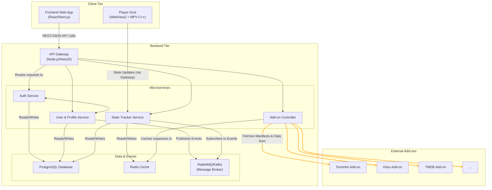
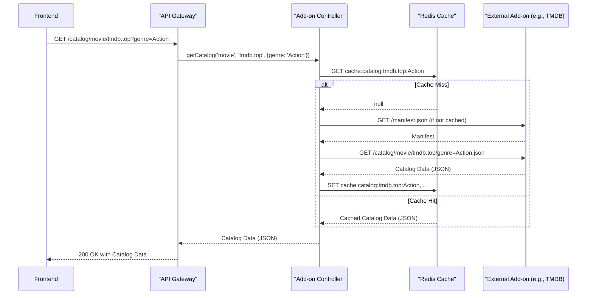
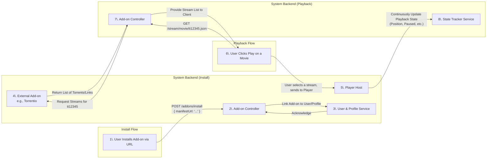

---

# Streamtario

## **Architecture Document: A Decoupled Streaming Ecosystem**

### 1. Project Vision & Core Architectural Decisions

The goal is to create a modular, multi-tenant streaming application centered around a dynamic add-on ecosystem. To achieve the requested flexibility and scalability, we will base our architecture on the following core principles:

*   **Architectural Pattern**: We will employ a **Microservices Architecture** where each service adheres to the principles of **Clean Architecture**. This isolates business logic (Use Cases, Entities) from external concerns (Frameworks, Databases, UI), making the system independently deployable, scalable, and maintainable.
*   **Repository Strategy**: A **Monorepo** managed with a `.code-workspace` is the suggested approach. This simplifies dependency management for shared libraries (e.g., the `core` library), facilitates atomic commits across multiple services, and streamlines the development environment setup.
*   **Communication Protocols**:
    *   **Client ↔ Backend**: A primary **RESTful API with JSON** will be exposed via an API Gateway. This is web-standard, easy to consume, and stateless.
    *   **Internal Service-to-Service**: For synchronous internal communication, **gRPC** is recommended for its performance benefits and strongly-typed contracts.
    *   **Asynchronous Events**: A **Message Broker** (RabbitMQ is a great start, Kafka for higher throughput scenarios) will be used for decoupled event-driven communication (e.g., "ProfileUpdated", "NewAddonInstalled", "PlaybackProgress").

### 2. High-Level System Blueprint (Monorepo)

Here is the proposed monorepo structure and a component diagram illustrating the overall system.

#### **Suggested Monorepo Folder Structure**

```
/Streamtario/
├── Streamtario.code-workspace
├── apps/
│   ├── 1-frontend/               # Next.js (React/TS)
│   ├── 2-api-gateway/            # Node.js (e.g., NestJS or Express)
│   ├── 3-auth-service/           # Python (FastAPI)
│   ├── 4-user-profile-service/   # Python (FastAPI)
│   ├── 5-addon-controller/       # Python (FastAPI)
│   ├── 6-state-tracker-service/  # Python (FastAPI)
│   └── 7-player-host/            # C++ (WebView2 Host + MPV integration)
├── packages/
│   └── core/                     # Shared Types & Business Rules (TS/Python stubs)
├── build/
│   ├── scripts/                  # Build & packaging scripts (Bash, PowerShell)
│   └── dist/                     # Output directory for production builds
│       ├── portable/
│       └── installer/
└── docker-compose.yml            # For local development environment
```

#### **Component Diagram**

This diagram shows the primary components and their interactions.



### 3. Service Interaction & Data Flow Diagrams

#### **Data Flow: User Fetches a Catalog**

This sequence shows how the frontend requests catalog data, which is dynamically sourced from an installed add-on.



#### **Add-on Lifecycle & Streaming Flow**

This diagram illustrates installing an add-on and then using it to find a stream.



### 4. Manifest & Add-on SDK Specification

The add-on system is the core of this project. The `manifest.json` is its contract. Based on the provided examples, we can define a comprehensive JSON Schema.

#### **JSON Schema for `manifest.json`**

```json
{
  "$schema": "http://json-schema.org/draft-07/schema#",
  "title": "Streaming App Add-on Manifest",
  "type": "object",
  "required": ["id", "version", "name", "description", "resources", "types"],
  "properties": {
    "id": { "type": "string", "description": "Unique identifier, e.g., community.anime.kitsu." },
    "version": { "type": "string", "description": "Semantic version, e.g., 1.0.0." },
    "name": { "type": "string", "description": "Human-readable name." },
    "description": { "type": "string", "description": "A brief summary of the add-on's function." },
    "logo": { "type": "string", "format": "uri", "description": "URL to a logo image." },
    "background": { "type": "string", "format": "uri", "description": "URL to a background image for branding." },
    "contactEmail": { "type": "string", "format": "email", "description": "Contact for support." },
    
    "resources": {
      "type": "array",
      "description": "An array of resources this add-on provides.",
      "items": {
        "oneOf": [
          { "type": "string", "enum": ["catalog", "meta", "stream", "subtitles"] },
          {
            "type": "object",
            "properties": {
              "name": { "type": "string" },
              "types": { "type": "array", "items": { "type": "string" } },
              "idPrefixes": { "type": "array", "items": { "type": "string" } }
            },
            "required": ["name", "types"]
          }
        ]
      }
    },
    
    "types": {
      "type": "array",
      "description": "Content types supported, e.g., movie, series, anime, tv.",
      "items": { "type": "string" }
    },

    "idPrefixes": {
      "type": "array",
      "description": "ID prefixes this add-on can provide metadata or streams for (e.g., 'tt', 'kitsu', 'tmdb:').",
      "items": { "type": "string" }
    },
    
    "catalogs": {
      "type": "array",
      "description": "List of browsable catalogs provided by the add-on.",
      "items": {
        "type": "object",
        "properties": {
          "id": { "type": "string" },
          "type": { "type": "string" },
          "name": { "type": "string" },
          "extra": {
            "type": "array",
            "items": {
              "type": "object",
              "properties": {
                "name": { "type": "string", "description": "Parameter name, e.g., 'genre', 'skip', 'search'." },
                "isRequired": { "type": "boolean" },
                "options": { "type": "array", "items": { "type": "string" } },
                "optionsLimit": { "type": "integer" }
              },
              "required": ["name"]
            }
          },
          "genres": { "type": "array", "items": { "type": "string" }, "description": "Legacy support for simple genre lists." }
        },
        "required": ["id", "type", "name"]
      }
    },
    
    "behaviorHints": {
      "type": "object",
      "properties": {
        "configurable": { "type": "boolean" },
        "configurationRequired": { "type": "boolean" }
      }
    }
  }
}
```

### 5. Front-End Protocol Specification

The front-end is "headless" and renders UI based on instructions from the backend. This ensures maximum flexibility. The protocol will be a set of structured JSON objects that define a view.

**Example 1: A Catalog View Response**

This response tells the front-end to render a grid of movies and provides the necessary filter controls, which were defined by the add-on's manifest.

`GET /view/catalog/movie/tmdb.top`

```json
{
  "view": {
    "type": "grid",
    "title": "Popular Movies"
  },
  "controls": [
    {
      "id": "genre",
      "type": "select",
      "label": "Genre",
      "options": ["Action", "Adventure", "Comedy", "..." ]
    },
    {
      "id": "sort",
      "type": "select",
      "label": "Sort By",
      "options": ["Popularity", "Release Date", "Rating"]
    }
  ],
  "items": [
    {
      "id": "tmdb:12345",
      "type": "movie",
      "name": "Super Awesome Movie",
      "poster": "https://image.tmdb.org/...",
      "year": 2024
    },
    {
      "id": "tmdb:67890",
      "type": "movie",
      "name": "Another Great Film",
      "poster": "https://image.tmdb.org/...",
      "year": 2025
    }
  ],
  "pagination": {
    "hasMore": true,
    "nextCursor": "skip=20" 
  }
}
```

**Example 2: A Meta View Response (Detail Page)**

`GET /view/meta/movie/tmdb:12345`

```json
{
  "view": {
    "type": "detail",
    "title": "Super Awesome Movie"
  },
  "item": {
    "id": "tmdb:12345",
    "name": "Super Awesome Movie",
    "description": "The best movie ever made about a...",
    "background": "https://.../background.jpg",
    "genres": ["Action", "Sci-Fi"],
    "cast": ["Actor One", "Actor Two"],
    "director": ["Director Name"],
    "rating": 8.8,
    "actions": [
      { "id": "toggle-favorite", "label": "Add to Favorites", "icon": "heart" },
      { "id": "toggle-watchlist", "label": "Add to Watchlist", "icon": "list" }
    ]
  }
}
```

### 6. Deliverables & Next Steps

This architecture document serves as the foundational blueprint. The proposed structure is designed for evolution, exactly as your initial prompt requested.

#### **Next Steps**

We are now in an excellent position to begin building. The path forward is:

1.  **Initialize the Monorepo**: Set up the complete folder structure (`apps`, `packages`, etc.) and the `.code-workspace` file. Initialize `git`.
2.  **Define the `core` Library**: Create the initial data models (e.g., `User`, `Profile`, `Manifest`, `MetaItem`) using Pydantic for Python and corresponding TypeScript interfaces. This will be the shared language between services.
3.  **Skeleton Service Development**: For each service in the `apps/` directory:
    *   Create a basic project (e.g., `fastapi new`, `npx nest new`).
    *   Set up a `Dockerfile` for containerization.
    *   Implement a health check endpoint (e.g., `/health`).
    *   **Crucially, set up the Dependency Injection container** to wire up placeholder services and repositories, preparing for the implementation of business logic.
4.  **Develop the Add-on Controller**: This is the most critical service. The first goal should be to implement a function that can fetch, parse, and validate a manifest URL against the JSON schema defined above.
5.  **Build a Proof-of-Concept Frontend View**: Create a simple Next.js page that calls the `Add-on Controller` (via the Gateway) to fetch data from a real add-on (like the TMDB one) and renders it using the Front-End Protocol. This will validate the entire data flow chain.