# Streamtario (Beta)

**A modern, media streaming platform inspired by Stremio, built on a powerful microservices architecture.**

---

### 🎥 Demo 

https://github.com/user-attachments/assets/fe2326ab-b8dc-43c5-b529-5ab1a416bc66

---

### ✨ Features

*   **👤 Account & Profile Management**: Secure account creation (email/password & social login - just google for now) with support for multiple, customizable user profiles.
*   **🔒 Private Profiles**: Protect profiles with a 4-digit PIN for privacy.
*   **🧩 Extensive Addon System**: Install, uninstall, and manage addons across single or all profiles.
    *   **Official & Community Catalogs**: Browse and discover addons from official and community sources.
    *   **Install from URL**: Directly install any compatible third-party Stremio addon.
*   **🌐 Rich Content Discovery**:
    *   Dynamic "Home" page aggregating content from all installed addons.
    *   Advanced "Discover" view with dynamic filtering by content type, provider, genre, and more.
*   **⚡ Real-time Search**: Instantaneous, live search results aggregated from all installed addons simultaneously.
*   **🎬 Detailed Metadata View**: A comprehensive metadata screen that aggregates information (posters, backgrounds, cast, episodes, etc.) from multiple addon sources for a unified view.
*   **▶️ Continue Watching**: Keep track of your viewing progress and easily resume from where you left off.
*   ** torrent Streaming**: Robust backend powered by a custom torrent client daemon for efficient real-time streaming.
*   **🖥️ High-Performance Desktop Client**: A native desktop experience using a C++ host that combines a modern WebView2 frontend with a powerful, embedded MPV player for high-quality playback.
*   **⚙️ Advanced Settings**: In-depth configuration per profile, including player settings, streaming cache, and more. (In Progress)
*   **🔐 Secure Authentication**: JWT-based authentication with secure refresh token rotation handled by a dedicated `auth-service`.
*   **🚀 Federated GraphQL API**: A unified, scalable GraphQL API gateway that federates schemas from backend microservices.

---

### 🚀 Technical Deep Dive

Streamtario is not just a clone; it's a complete, ground-up re-imagining of a modern streaming application using a distributed, microservices-oriented architecture.

#### Architecture Overview

The system is composed of several independent services that communicate via REST APIs, a federated GraphQL gateway, and a Redis event bus. This design ensures separation of concerns, scalability, and resilience.

#### Technology Stack

| Category              | Technology                                                                                                    |
| --------------------- | ------------------------------------------------------------------------------------------------------------- |
| **Frontend**          | [TypeScript](https://www.typescriptlang.org/), [React](https://reactjs.org/), [Next.js](https://nextjs.org/), [Tailwind CSS](https://tailwindcss.com/), [Radix UI](https://www.radix-ui.com/), [TanStack Query](https://tanstack.com/query) |
| **Desktop Shell**     | [C++](https://isocpp.org/), [Microsoft WebView2](https://developer.microsoft.com/en-us/microsoft-edge/webview2/), [MPV Player](https://mpv.io/)                                  |
| **API Gateway**       | [Apollo Gateway](https://www.apollographql.com/docs/gateway/), [Express.js](https://expressjs.com/), [GraphQL-WS](https://github.com/enisdenjo/graphql-ws)                    |
| **Backend Services**  | [Python 3](https://www.python.org/), [FastAPI](https://fastapi.tiangolo.com/), [Strawberry (GraphQL)](https://strawberry.rocks/), [Pydantic](https://pydantic-docs.help.cn/)               |
| **Streaming Engine**  | [Go](https://golang.org/) (Torrent Daemon), [TypeScript/Node.js](https://nodejs.org/) (Streaming Controller)                                      |
| **Database & Cache**  | [PostgreSQL](https://www.postgresql.org/) (Primary DB), [Redis](https://redis.io/) (Caching, Pub/Sub Event Bus)                                   |
| **ORM & Migrations**  | [SQLAlchemy 2.0 (Async)](https://www.sqlalchemy.org/), [Alembic](https://alembic.sqlalchemy.org/)                                               |
| **DI Framework**      | [dependency-injector](https://python-dependency-injector.ets-labs.org/) (Python)                                                                |

#### Service Breakdown

*   **`api-gateway`**: The single entry point for the frontend. It uses **Apollo Federation** to combine the GraphQL schemas of the `account-profile-service` and `addon-controller-service` into one unified graph. It also proxies REST/WebSocket traffic to the appropriate downstream services (`auth-service`, `streaming-service`).

*   **`account-profile-service` (Python)**: Manages all user-related data.
    *   **Responsibilities**: Account creation, profile management, addon installation records, playback history.
    *   **Architecture**: Implements a clean, layered architecture with a distinct separation between the domain, application (use cases), and infrastructure layers. It uses the **Unit of Work** and **Repository** patterns for transactional database operations with SQLAlchemy.
    *   **Events**: Publishes domain events (e.g., `AddonInstalledEvent`) to a Redis channel to notify other services of state changes.

*   **`addon-controller-service` (Python)**: The brain of content aggregation.
    *   **Responsibilities**: Fetches, parses, caches, and aggregates data from third-party Stremio addon `manifest.json` files. It handles all content discovery, searching, and metadata fetching.
    *   **Caching**: Utilizes multiple layers of caching (in-memory request cache, Redis for manifests, Redis for profile-specific addon lists) for high performance.
    *   **Event-Driven**: Subscribes to Redis events from the `account-profile-service` to invalidate its profile addon cache in real-time.

*   **`auth-service` (Python)**: A dedicated service for handling authentication logic.
    *   **Responsibilities**: Manages email/password and Google social logins. It validates credentials by communicating with the `account-profile-service` and issues JWT access and refresh tokens upon success.

*   **`streaming-service` (TypeScript)**: The controller for the torrent engine.
    *   **Responsibilities**: Provides a clean API for the frontend to start, stop, and monitor streams. It communicates with the `torrserver-daemon` to manage torrents and proxies the video stream to the client. It also exposes a WebSocket for real-time streaming statistics.

*   **`torrserver-daemon` (Go)**: A minimal, high-performance torrent client based on the Anacrolix torrent library.
    *   **Responsibilities**: Manages the torrent session, downloads pieces on-demand for streaming, and provides file-level stats. It is designed to be a lightweight, headless engine controlled by the `streaming-service`.

*   **`webview2-host` (C++)**: The native Windows desktop application.
    *   **Responsibilities**: Hosts the Next.js frontend within a borderless WebView2 control. It embeds an MPV player instance, binding it to the main window handle. It facilitates a two-way communication protocol between the JavaScript frontend and the C++ backend to control playback, creating a seamless and highly performant native media player experience.

### Project State

This project is currently in a **Beta** stage. The core architecture is stable, and a wide range of features are fully implemented and functional. The focus is now on refining the user experience, adding more advanced features, and ensuring stability.

### What's Working and a Future Roadmap
-   [x] Full user authentication and profile system.
-   [x] Complete addon management lifecycle.
-   [x] Content discovery, home page, and real-time search.
-   [x] Metadata aggregation and detailed views.
-   [x] Torrent streaming and high-quality playback via MPV.
-   [x] Continue watching and playback progress tracking.
-   [ ] **Advanced Player and User Settings**: Integration of advanced MPV settings (shaders, custom configs) from the settings UI, Cache control and external Player support.
-   [x] **Subtitle Support**: (partially working) Full subtitle integration, including fetching from addons and user uploads.
-   [ ] **Cross-platform Support**: Explore options for macOS and Linux desktop clients (e.g., using Tauri or a similar framework).
-   [ ] **UI/UX Polish**: Continue to refine animations, transitions, and overall user interface responsiveness.
-   [x] **Improved Error Handling**: (Mostly handled but need refining edge cases) More granular error feedback throughout the application.
-   [x] **Improved Cashing**: (Patialy working) needs more refining to make sure we avoid rate liming on many providers.
-   [ ] **Comprehensive Testing**: Implimenting test coverage across all services.

### Getting Started (Local Development - Still needs configuration for clone and run, but here at is for anyone who wants to play around with it, ill create a build script at some point.)

1.  **Prerequisites**:
    *   Python 3.10+
    *   Node.js 18+
    *   Go 1.18+
    *   PostgreSQL
    *   Redis
    *   C++ Build Tools (Visual Studio with C++ workload)
    *   `vcpkg` for C++ dependency management.

2.  **Initial Setup**:
    *   Clone the repository.
    *   Create a root `.env` file by copying `.env.example` and fill in your PostgreSQL and Redis details.
    *   Run `db_cli.py create` to create the initial database.
    *   Run `db_cli.py upgrade` to apply all database migrations.

3.  **Backend Services (Python)**:
    *   Create a virtual environment: `python -m venv venv` in the root of the project where requirement.txt lives.
    *   Install dependencies: `pip install -r requirements.txt`
    *   Run the service using the provided debug runner or directly with `uvicorn`.

4.  **Frontend (Next.js)**:
    *   Navigate to `apps/frontend`.
    *   Install dependencies: `npm install`
    *   Run the development server: `npm run dev`

5.  **Desktop Client (C++)**:
    *   Open the `apps/webview2-host` directory in Visual Studio or VS Code with CMake tools.
    *   Configure and build the project. The executable will be placed in the `build` directory.

### License

This project is licensed under the MIT License. See the `LICENSE` file for details.

### Acknowledgements

*   The **Stremio** team for the inspiration and the open-source addon ecosystem.
*   The developers of all the open-source libraries and frameworks that made this project possible.
